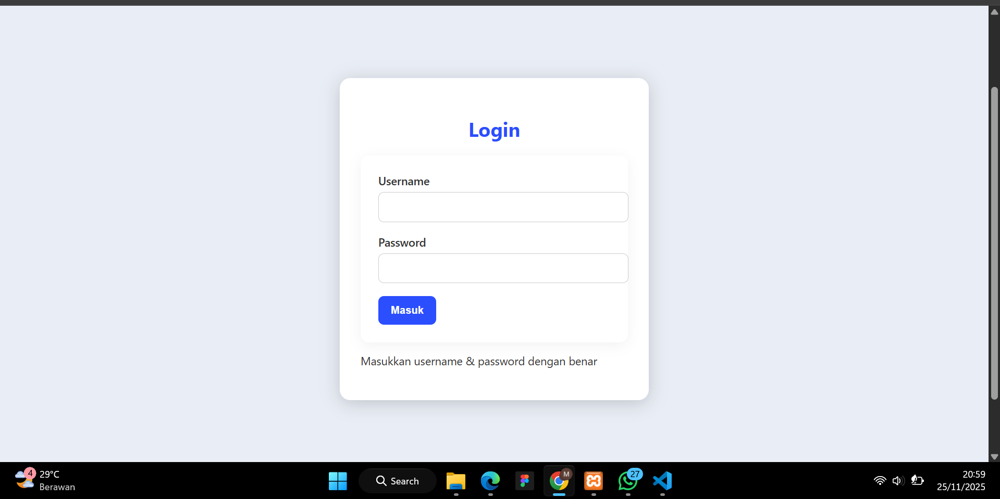
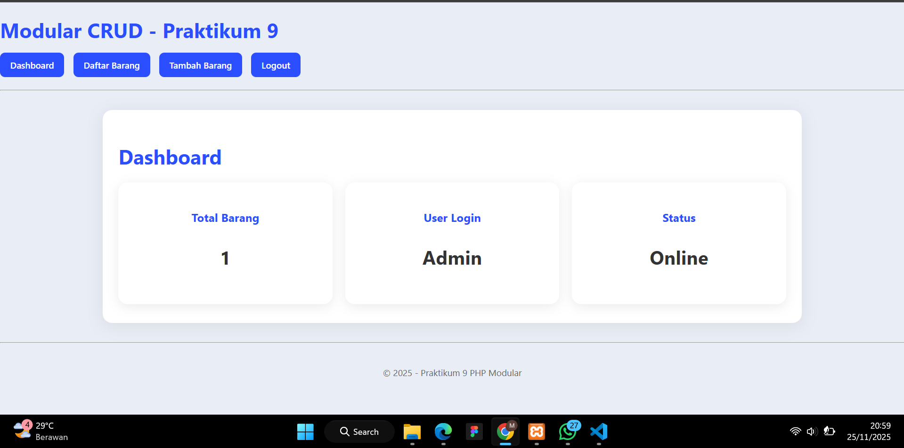
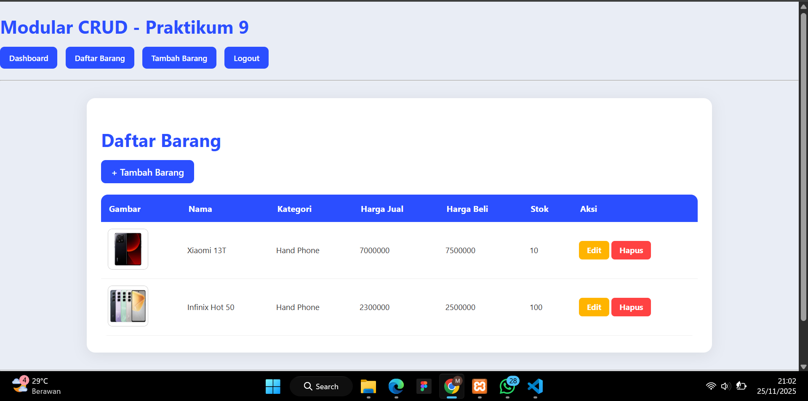
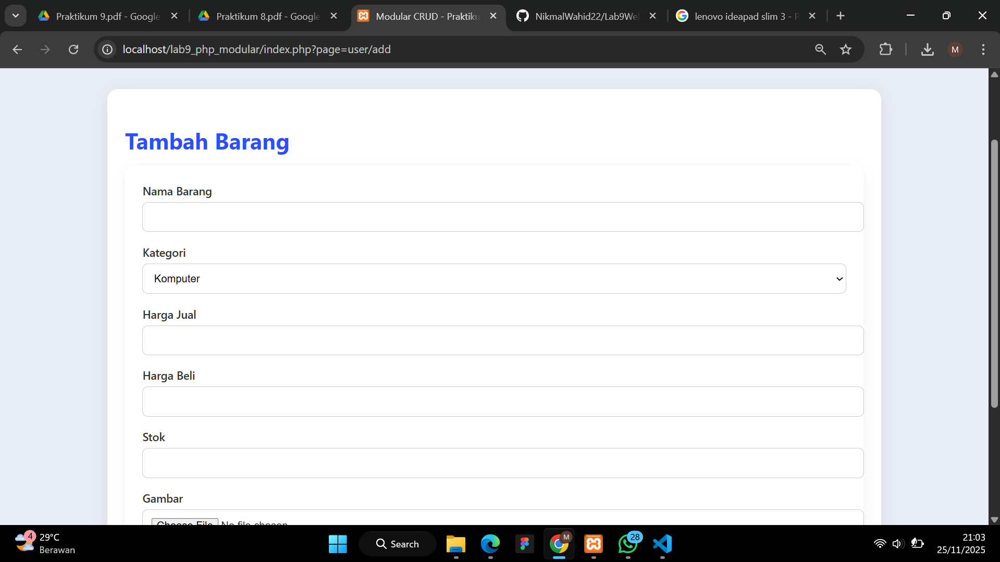
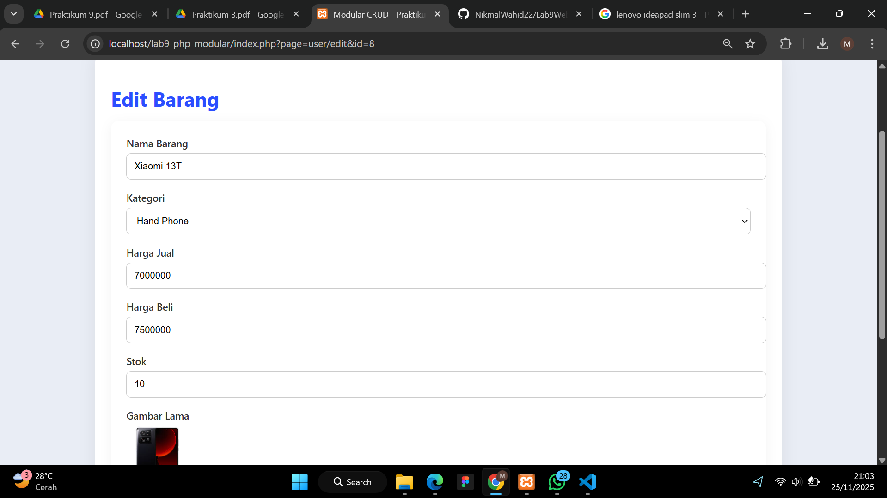
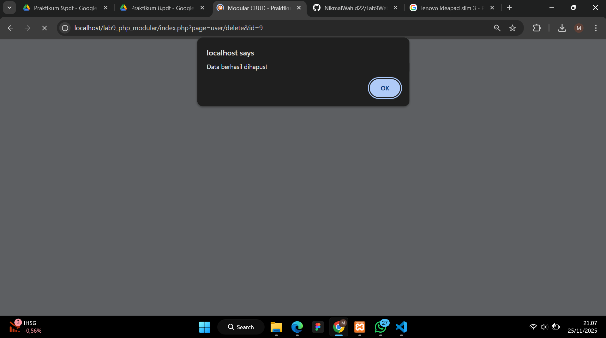

- Nama: Muhamad Nikmal Wahid
- Kelas: TI 24 A3

# PHP MODULAR 
## INSTRUKSI PRATIKUM DAN TUGAS 
Pertanyaan dan Tugas
Implementasikan konsep modularisasi pada kode program praktikum 8 tentang database,sehingga setiap halamannya memiliki template tampilan yang sama. Dan terapkan penggunaan Routing agar project menjadi lebih modular.

## INDEX.PHP
```
<?php
session_start();

// load config & template
require 'config/database.php';
require 'views/header.php';

// ambil parameter page
$page = isset($_GET['page']) ? $_GET['page'] : 'dashboard';

// halaman yang butuh login
$protected_pages = [
    'dashboard',
    'user/list',
    'user/add',
    'user/edit',
    'user/delete'
];

if (in_array($page, $protected_pages) && !isset($_SESSION['login'])) {
    echo "<script>alert('Login dulu bro!'); window.location='index.php?page=auth/login';</script>";
    exit;
}

// ROUTING
switch ($page) {

    case 'user/list':
        require 'modules/user/list.php';
        break;

    case 'user/add':
        require 'modules/user/add.php';
        break;

    case 'user/edit':
        require 'modules/user/edit.php';
        break;

    case 'user/delete':
        require 'modules/user/delete.php';
        break;

    case 'auth/login':
        require 'modules/auth/login.php';
        break;

    case 'auth/logout':
        require 'modules/auth/logout.php';
        break;

    default:
        require 'views/dashboard.php';
        break;
}

require 'views/footer.php';
?>
```
File ini merupakan pusat dari seluruh aplikasi. index.php berfungsi sebagai router, yaitu file yang menentukan halaman mana yang ditampilkan berdasarkan parameter ?page= pada URL. Di dalam file ini juga terdapat pengecekan session untuk memastikan bahwa halaman tertentu hanya bisa diakses setelah user login. Selain itu, index.php juga memanggil template header dan footer agar tampilan halaman tetap konsisten.

## Database.php

```
<?php
$host = "localhost";
$user = "root";
$pass = "";
$db   = "latihan1"; // sesuaikan dengan nama database kamu

$conn = mysqli_connect($host, $user, $pass, $db);

if (!$conn) {
    die("Koneksi gagal: " . mysqli_connect_error());
}
?>
```
File ini digunakan untuk membuat koneksi ke database MySQL. File ini berisi variabel host, user, password, dan nama database yang kemudian dipakai di seluruh file lain menggunakan include atau require. Tujuannya agar koneksi database hanya ditulis satu kali dan dapat digunakan secara modular.

## Login.php
```
<div class="login-wrapper">
    <div class="login-card">
        <h2>Login</h2>

        <form method="post">
            <label>Username</label>
            <input type="text" name="username" required>

            <label>Password</label>
            <input type="password" name="password" required>

            <button type="submit" name="login">Masuk</button>
        </form>

        <p>Masukkan username & password dengan benar</p>
    </div>
</div>


<?php
if (isset($_POST['login'])) {

    $username = $_POST['username'];
    $password = $_POST['password'];

    // contoh user login hardcode (bisa pakai tabel users kalau ada)
    if ($username === "admin" && $password === "admin") {
        $_SESSION['login'] = true;
        echo "<script>alert('Login berhasil'); window.location='index.php';</script>";
    } else {
        echo "<script>alert('Username/Password salah');</script>";
    }
}
?>
```



login.php merupakan halaman autentikasi yang digunakan untuk masuk ke dalam aplikasi. File ini berisi form login serta logika untuk memeriksa username dan password. Jika login berhasil, session akan disimpan dan user diarahkan ke dashboard

## Dashboard.php 
```
<div class="container">
    <h1>Dashboard</h1>

    <div class="dashboard-cards">
        <div class="card">
            <h3>Total Barang</h3>
            <p>
            <?php
            $q = mysqli_query($conn, "SELECT COUNT(*) AS total FROM data_barang");
            $d = mysqli_fetch_assoc($q);
            echo $d['total'];
            ?>
            </p>
        </div>

        <div class="card">
            <h3>User Login</h3>
            <p>Admin</p>
        </div>

        <div class="card">
            <h3>Status</h3>
            <p>Online</p>
        </div>
    </div>
</div>
```



Halaman ini adalah tampilan utama setelah user login. Dashboard menampilkan ringkasan data dengan card, seperti jumlah total barang, informasi user login, dan status aplikasi. Halaman ini menggunakan data dari database untuk menampilkan statistik secara dinamis.

##  Header.php 
```
<?php
if (session_status() === PHP_SESSION_NONE) {
    session_start();
}
?>
<!DOCTYPE html>
<html>
<head>
    <meta charset="UTF-8">
    <title>Modular CRUD - Praktikum 9</title>
     <link rel="stylesheet" href="assets/style.css">
</head>
<body>

<h1>Modular CRUD - Praktikum 9</h1>

<nav>
    <?php if (isset($_SESSION['login'])): ?>
        <a href="index.php">Dashboard</a>
        <a href="index.php?page=user/list">Daftar Barang</a>
        <a href="index.php?page=user/add">Tambah Barang</a>
        <a href="index.php?page=auth/logout">Logout</a>
    <?php else: ?>
        <a href="index.php?page=auth/login">Login</a>
    <?php endif; ?>
</nav>

<hr>
```


File header.php adalah template bagian atas halaman (layout). Isinya mencakup deklarasi HTML, tag <head>, link CSS, serta navbar menu. File ini dipanggil di semua halaman kecuali halaman login agar tampilan aplikasi tetap seragam dan profesional.

## Footer.php

```
<hr>
<footer>
    <p>&copy; 2025 - Praktikum 9 PHP Modular</p>
</footer>
</div>
</body>
</html>
```


## List.php
```
<?php
$query = mysqli_query($conn, "SELECT * FROM data_barang");
?>

<div class="container">
    <h1>Daftar Barang</h1>

    <a href="index.php?page=user/add" class="btn-primary">+ Tambah Barang</a>

    <table>
        <tr>
            <th>Gambar</th>
            <th>Nama</th>
            <th>Kategori</th>
            <th>Harga Jual</th>
            <th>Harga Beli</th>
            <th>Stok</th>
            <th>Aksi</th>
        </tr>

        <?php while ($row = mysqli_fetch_assoc($query)): ?>
        <tr>
            <td>"></td>
            <td><?= $row['nama']; ?></td>
            <td><?= $row['kategori']; ?></td>
            <td><?= $row['harga_jual']; ?></td>
            <td><?= $row['harga_beli']; ?></td>
            <td><?= $row['stok']; ?></td>
            <td>
                <a class="btn-warning" href="index.php?page=user/edit&id=<?= $row['id_barang']; ?>">Edit</a>
                <a class="btn-danger" onclick="return confirm('Yakin?')" href="index.php?page=user/delete&id=<?= $row['id_barang']; ?>">Hapus</a>
            </td>
        </tr>
        <?php endwhile; ?>

    </table>
</div>
```


File list.php berfungsi untuk menampilkan seluruh data barang dalam bentuk tabel. Data diambil dari database dan ditampilkan dengan tombol aksi seperti Edit dan Hapus. Ini adalah bagian “Read” dalam konsep CRUD.

## Add.php
```
<?php
if (isset($_POST['submit'])) {

    $nama = $_POST['nama'];
    $kategori = $_POST['kategori'];
    $harga_jual = $_POST['harga_jual'];
    $harga_beli = $_POST['harga_beli'];
    $stok = $_POST['stok'];

    $gambar = "";
    if (!empty($_FILES['file_gambar']['name'])) {
        $filename = time() . "_" . $_FILES['file_gambar']['name'];
        $path = "uploads/" . $filename;

        if (move_uploaded_file($_FILES['file_gambar']['tmp_name'], $path)) {
            $gambar = $filename;
        }
    }

    $sql = "INSERT INTO data_barang (nama, kategori, harga_jual, harga_beli, stok, gambar)
            VALUES ('$nama', '$kategori', '$harga_jual', '$harga_beli', '$stok', '$gambar')";

    mysqli_query($conn, $sql);

    echo "<script>alert('Data berhasil ditambahkan'); window.location='index.php?page=user/list';</script>";
}
?>

<div class="container">
    <h1>Tambah Barang</h1>

    <form method="post" enctype="multipart/form-data">

        <label>Nama Barang</label>
        <input type="text" name="nama" required>

        <label>Kategori</label>
        <select name="kategori" required>
            <option value="Komputer">Komputer</option>
            <option value="Elektronik">Elektronik</option>
            <option value="Hand Phone">Hand Phone</option>
        </select>

        <label>Harga Jual</label>
        <input type="text" name="harga_jual" required>

        <label>Harga Beli</label>
        <input type="text" name="harga_beli" required>

        <label>Stok</label>
        <input type="text" name="stok" required>

        <label>Gambar</label>
        <input type="file" name="file_gambar">

        <button type="submit" name="submit" class="btn-primary">Simpan</button>
    </form>
</div>
```


File ini digunakan untuk menambah data barang baru. Halaman berisi form input seperti nama barang, kategori, harga, stok, dan upload gambar. Data yang dikirim akan diproses menggunakan query INSERT ke database. File gambar yang di-upload disimpan ke folder uploads/.

## Edit.php
```
<?php
$id = $_GET['id'];
$query = mysqli_query($conn, "SELECT * FROM data_barang WHERE id_barang = $id");
$data = mysqli_fetch_assoc($query);

if (isset($_POST['submit'])) {

    $nama = $_POST['nama'];
    $kategori = $_POST['kategori'];
    $harga_jual = $_POST['harga_jual'];
    $harga_beli = $_POST['harga_beli'];
    $stok = $_POST['stok'];

    $gambar_baru = $data['gambar'];

    if (!empty($_FILES['file_gambar']['name'])) {
        $filename = time() . "_" . $_FILES['file_gambar']['name'];
        $path = "uploads/" . $filename;

        if (move_uploaded_file($_FILES['file_gambar']['tmp_name'], $path)) {
            $gambar_baru = $filename;
        }
    }

    $sql = "UPDATE data_barang SET
            nama='$nama',
            kategori='$kategori',
            harga_jual='$harga_jual',
            harga_beli='$harga_beli',
            stok='$stok',
            gambar='$gambar_baru'
            WHERE id_barang=$id";

    mysqli_query($conn, $sql);

    echo "<script>alert('Data berhasil diubah'); window.location='index.php?page=user/list';</script>";
}
?>

<div class="container">
    <h1>Edit Barang</h1>

    <form method="post" enctype="multipart/form-data">

        <label>Nama Barang</label>
        <input type="text" name="nama" value="<?= $data['nama'] ?>" required>

        <label>Kategori</label>
        <select name="kategori">
            <option <?= $data['kategori']=="Komputer"?'selected':''; ?>>Komputer</option>
            <option <?= $data['kategori']=="Elektronik"?'selected':''; ?>>Elektronik</option>
            <option <?= $data['kategori']=="Hand Phone"?'selected':''; ?>>Hand Phone</option>
        </select>

        <label>Harga Jual</label>
        <input type="text" name="harga_jual" value="<?= $data['harga_jual'] ?>">

        <label>Harga Beli</label>
        <input type="text" name="harga_beli" value="<?= $data['harga_beli'] ?>">

        <label>Stok</label>
        <input type="text" name="stok" value="<?= $data['stok'] ?>">

        <label>Gambar Lama</label><br>
        " width="100"><br><br>

        <label>Gambar Baru</label>
        <input type="file" name="file_gambar">

        <button type="submit" name="submit" class="btn-primary">Simpan</button>
    </form>
</div>

```


File edit.php digunakan untuk mengubah data barang yang sudah ada. Data lama ditampilkan dalam form agar bisa diperbarui. Jika gambar baru di-upload, maka gambar lama akan diganti. Query UPDATE digunakan untuk menyimpan perubahan ke database.

## Hapus.php

```
<?php
$id = $_GET['id'];

$q = mysqli_query($conn, "SELECT gambar FROM data_barang WHERE id_barang='$id'");
$data = mysqli_fetch_assoc($q);

if(file_exists("uploads/" . $data['gambar'])){
    unlink("uploads/" . $data['gambar']);
}

$delete = mysqli_query($conn, "DELETE FROM data_barang WHERE id_barang='$id'");

if($delete){
    echo "<script>alert('Data berhasil dihapus!');
          window.location.href='index.php?page=user/list';</script>";
} else {
    echo "<p>Gagal menghapus data!</p>";
}
?>
```


## Logout.png
```
<?php
$id = $_GET['id'];

$q = mysqli_query($conn, "SELECT gambar FROM data_barang WHERE id_barang='$id'");
$data = mysqli_fetch_assoc($q);

if(file_exists("uploads/" . $data['gambar'])){
    unlink("uploads/" . $data['gambar']);
}

$delete = mysqli_query($conn, "DELETE FROM data_barang WHERE id_barang='$id'");

if($delete){
    echo "<script>alert('Data berhasil dihapus!');
          window.location.href='index.php?page=user/list';</script>";
} else {
    echo "<p>Gagal menghapus data!</p>";
}
?>
```


File ini digunakan untuk menghapus session login. Setelah logout, user diarahkan kembali ke halaman login. Fungsi logout ini bertujuan untuk mengamankan aplikasi dan memutus akses ke halaman CRUD.


